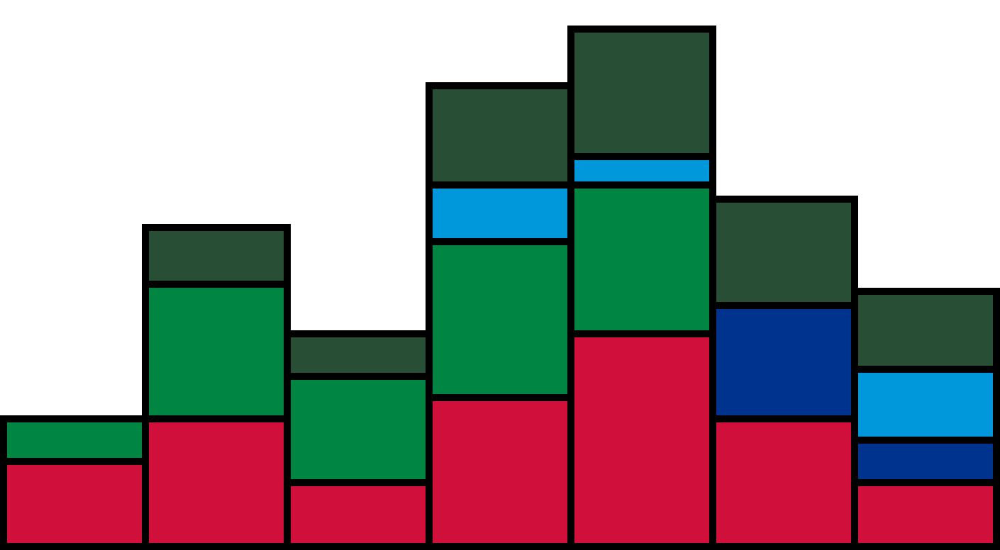
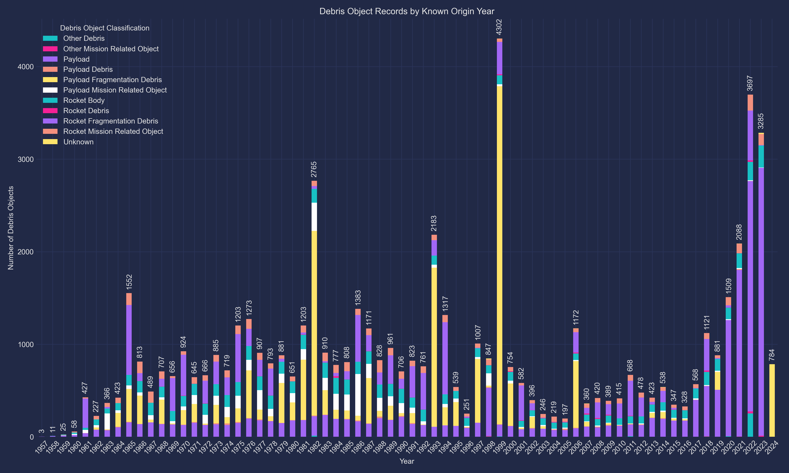
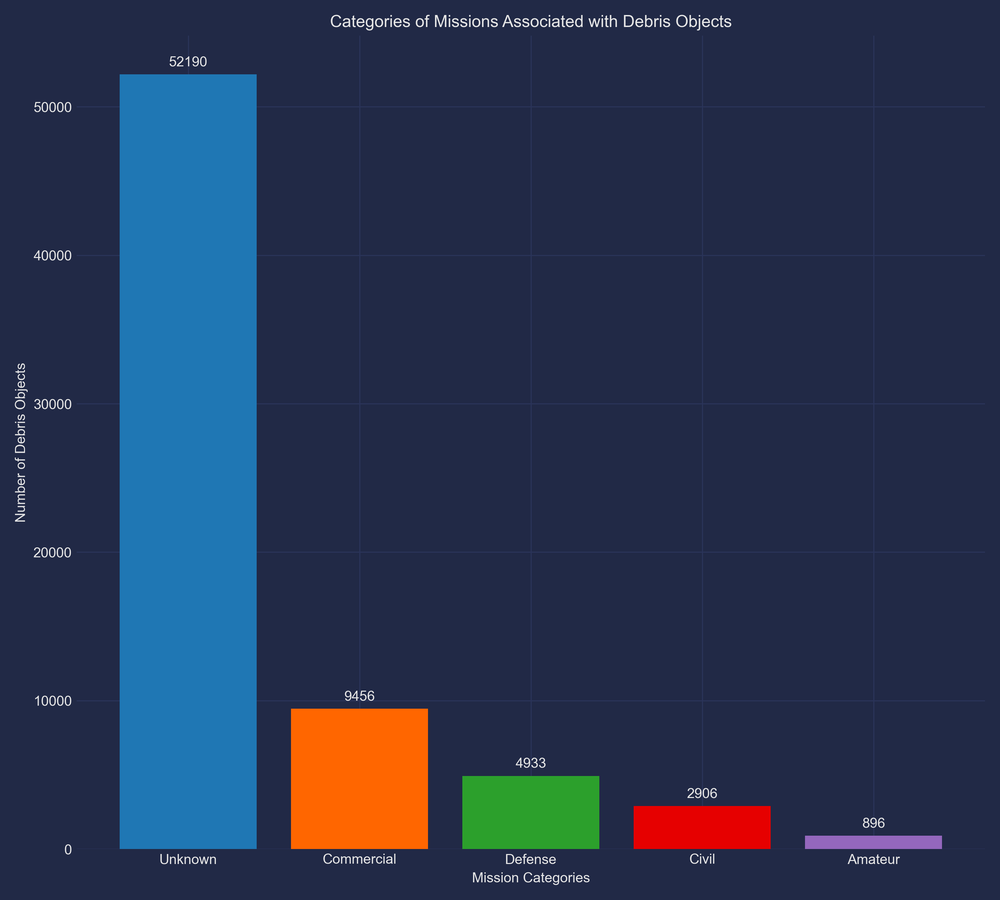
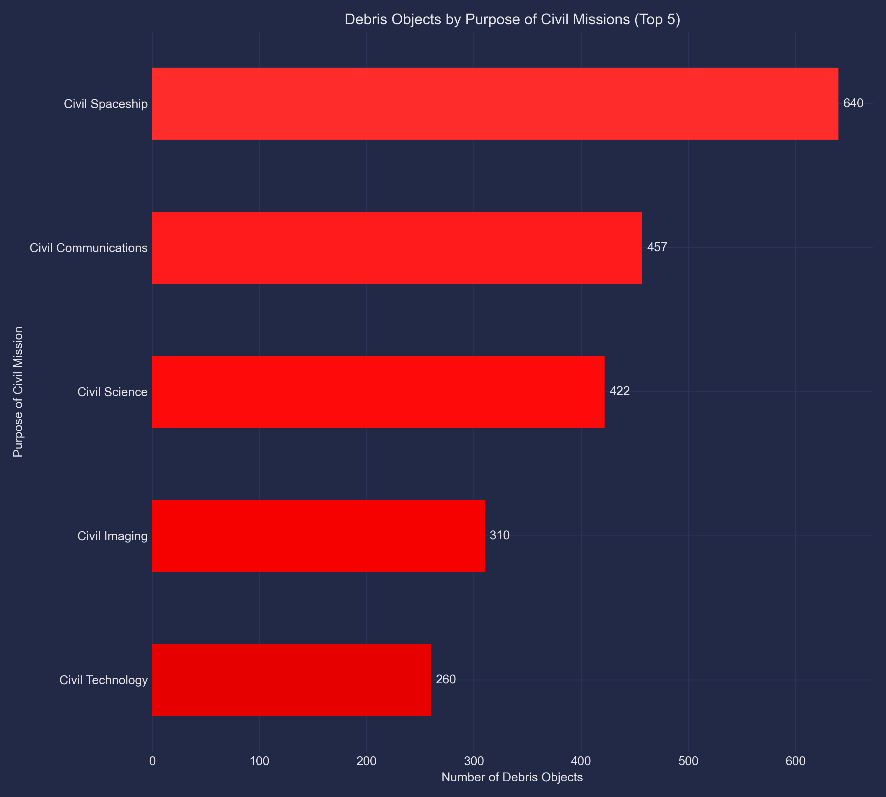
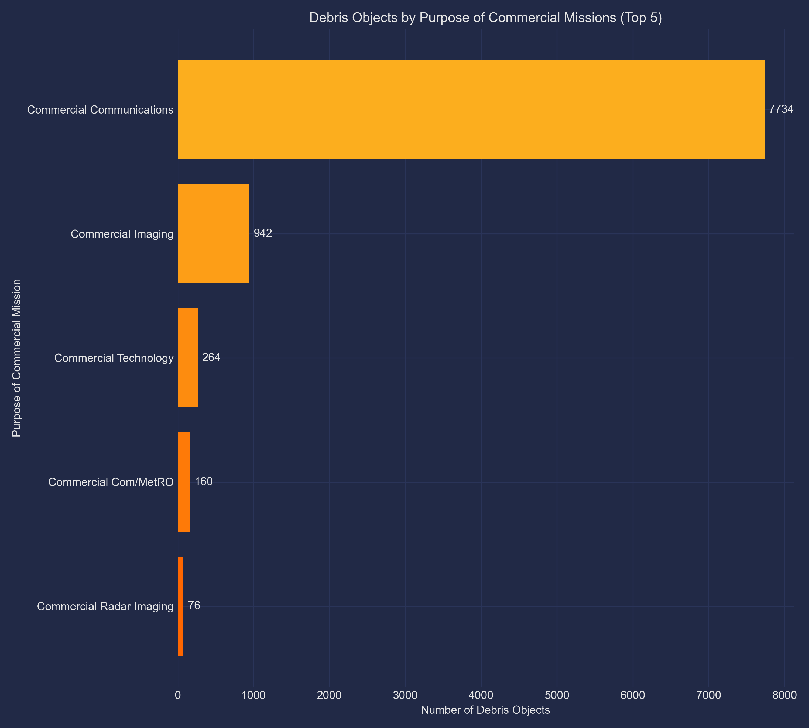
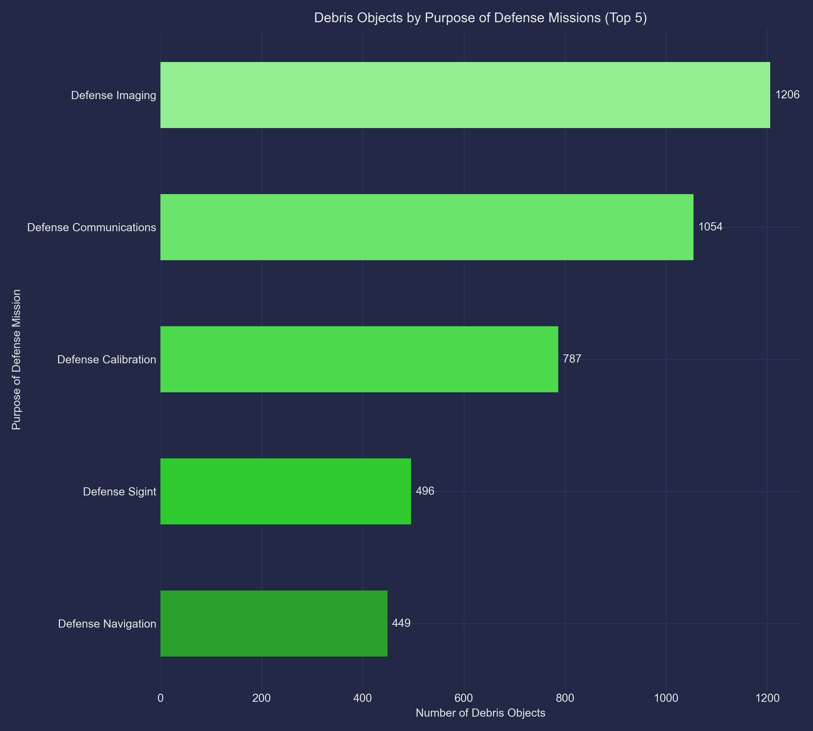
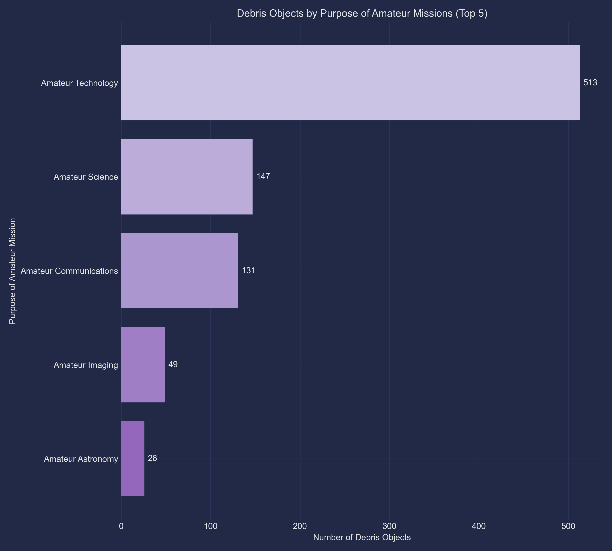
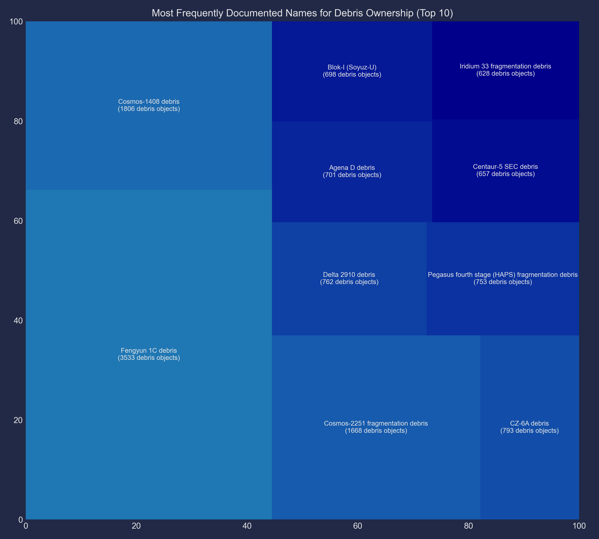

<!--- Created by Omer F. Keles (ORCID: 0000-0002-3004-1191) -->
# Orbital Debris Objects and Liability in Space

## Overview

This project analyzes space debris and expendable man-made objects launched into space (collectively referred to as "debris objects") as documented by the European Space Agency (ESA), with the purpose of assessing international liability in the proliferation of debris around the Earth's orbit. Liability is determined on the basis of known debris object ownership, launch year (derived from an object's [international designator, also known as a COSPAR ID](https://www.n2yo.com/database/)), and mission objectives.

Tracking the accumulation of space debris around the Earth's orbit is among one of many engineering and policy issues currently concerning the domain of space. The risks posed by the accumulation of space debris around the Earth’s orbit, while still frequently overlooked by space-faring actors and the general public, have begun to garner slightly increasing interest in recent years (with NASA releasing [Volume 1 of an integrated agencywide strategy to measure/assess space sustainability for Earth's orbit in April 2024](https://www.nasa.gov/spacesustainability/)).

The quantity of space debris continues to rise with the launch of more satellites and other man-made objects. [Missions in space will likely become more costly](https://www.nasa.gov/wp-content/uploads/2023/03/otps_-_cost_and_benefit_analysis_of_orbital_debris_remediation_-_final.pdf) (and needlessly convoluted) as frequent manuevering/shielding is necessitated to avoid potential collisions with debris generated from prior human space activity. As the number of debris objects in space increase, accurately tracking the origin and movement of these objects will become increasingly crucial for determining which actors may be liable under the [Outer Space Treaty](https://www.unoosa.org/oosa/en/ourwork/spacelaw/treaties/introouterspacetreaty.html) and [Liability Convention](https://www.unoosa.org/oosa/en/ourwork/spacelaw/treaties/introliability-convention.html). This would facilitate compensation being delivered to affected parties by liable actors, and may even assist [future active debris removal missions](https://clearspace.today/category/vespa-fragmentation/) to reduce future liability risks in the event of a subsequent collision. This is particularly of value in a world where there is currently no entity responsible for tracking space debris proliferation at an international scale. As part of efforts to mitigate the proliferation of space debris, it is evidently vital to understand where and why debris objects originate.

The findings of this project are designed as a supplement to my first peer-reviewed publication on space debris, which was published in *Telecommunications Policy* on April 2023. The publication, which focuses more directly on the telecommunications-related issues posed by space debris, can be found [here](https://doi.org/10.1016/j.telpol.2023.102517). Those intrigued by the outputs of this project (which focuses only on debris tracking) may find it suitable as a follow-up reading on debris mitigation and long-term prevention.

## Inputs

The entirety of the data used for this analysis is sourced from the ESA's DISCOS (Database and Information System Characterising Objects in Space) system. DISCOS serves as a single-source reference for launch information, object registration details, launch vehicle descriptions, spacecraft information, and orbital data histories for more than 40000 trackable, unclassified objects. DISCOS object data was accessed via registering for a [Space Debris User Account](https://sdup.esoc.esa.int/) with ESA, applying for an account to use [DISCOSweb](https://discosweb.esoc.esa.int/) (the dedicated web-based frontend to DISCOS), and obtaining an [access token](https://discosweb.esoc.esa.int/apidocs/v2) for version 2.0.0 of the DISCOSweb API (the latest version at the time of this project).

## Scripts

Two scripts, **extract.py** and **analyze.py**, are utilized for this project and run in that respective order.

### 1. extract.py

The **extract.py** script accesses version 2.0.0 of the DISCOSweb API, pulls the paginated data from the debris object database, and formats the local data fields for analysis by the subsequent script. A total of 70381 object records were accessed.

### 2. analyze.py

The **analyze.py** script reads in the formatted debris object data stored locally and outputs several visualizations that can be used to ascertain liability for documented debris object generation based on the original launch year of a debris object, the most common mission objectives associated with the generation of debris objects, and the most frequently named sources of debris objects according to the pulled DISCOSweb object database.

## Outputs

Seven outputs, **debris_objects_by_year.png**, **debris_objects_by_mission_category.png**, **debris_objects_by_civil.png**, **debris_objects_by_commercial.png**, **debris_objects_by_defense.png**, **debris_objects_by_amateur.png**, and **debris_objects_by_ownership.png** are produced for this project.

### 1. debris_objects_by_year.png

### 2. debris_objects_by_mission_category.png

### 3. debris_objects_by_civil.png

### 4. debris_objects_by_commercial.png

### 5. debris_objects_by_defense.png

### 6. debris_objects_by_amateur.png

### 7. debris_objects_by_ownership.png

## Findings

The visualizations produced by the two scripts revealed a number of interesting insights:
+ Out of objects with known origin years (**62411 objects from 1957 to 2024**), **1999** is the year associated with the most debris object records (**4302**). **Payloads** (not to be confused with separately classified, fragmented "payload debris") from launches also appeared to make up the majority of documented debris objects (with known object classifications) for most years. However, a plurality of records (70381 - 62411 = **7970**) had no documented year of origin.
+ For debris objects associated with launches that had known mission objectives, **commercial missions** appeared to be the most frequent motive behind the creation of these objects, while **amateur missions** were the least common reason associated with documented debris object generation. Yet, the vast majority of debris object records (**52190**) had no documented mission purpose associated with each object, suggesting that **no single sector is primarily liable for the accumulation of space debris** (and inherently reiterating the notion that **tracking space debris is an issue that spans multiple domains** and **ultimately requires coordinated international efforts to mitigate/manage**).
+ **Overall, the most common sources of space debris consist of endeavors from Russia** (Cosmos-1408, Cosmos-2251, Soyuz-U, Iridium 33), the **United States** (Agena D, Delta 2910, Centaur-5, Pegasus), and **China** (Fengyun 1C, CZ-6A). **This suggests that these countries are the most liable for space debris generation.** Such an assertion also aligns with prior findings (that can be read [here](https://www.statista.com/chart/28309/countries-creating-the-most-space-debris/) and [here](https://www.washingtonpost.com/opinions/interactive/2023/space-junk-debris-removal/)) that have similarly found these three nations to be particularly liable for growing quantities of debris generated in space.

It is important to note that these insights are primarily applicable to this database, which itself is limited in scope to *documented* debris objects by *one organization*. The total sample size of 70381 records also cannot authoritatively be said to be representative of the [100+ million debris objects estimated to be in orbit](https://www.esa.int/Space_Safety/Space_Debris/Space_debris_by_the_numbers) by the ESA's Space Debris Office. As debris objects continue to proliferate in space, tracking/documenting will become even more difficult over time. Nevertheless, these findings suggest that international collaboration and partnerships across the private/public sector to more thoroughly track, mitigate, and ultimately remove space debris will be crucial in the long term. Collective global undertaking of such comprehensive initiatives, in addition to serving to recognize space debris proliferation as a multistakeholder liability, may ultimately facilitate sustainable human activities in space for centuries to come.

## Acknowledgements

This project uses information from [ESA DISCOS](https://discosweb.esoc.esa.int/) (Database and Information System Characterising Objects in Space), a single-source reference for launch information, object registration details, launch vehicle descriptions, as well as spacecraft information for all trackable, unclassified objects. I acknowledge ESA's efforts to maintain and operate this database with its APIs.

Furthermore, this project would not have been possible without the constructive feedback and support provided by Pete Wilcoxen ([@pjwilcoxen](https://www.github.com/pjwilcoxen)), who thoughtfully gave countless hours of insights on both its technical and policy parameters. Additional thanks go to Pat Longstaff for her unwavering support and inspiration to engage more with the broader topic of space debris. I would also like to thank Sean O'Keefe and Harry Lambright, whose insights on space traffic management were very much appreciated during my time at the Maxwell School of Citizenship at Syracuse University.